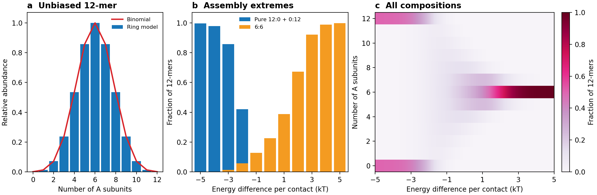

# Circular co-assembly of two proteins

This reconstructs the fixed-size ring model in the thesis source
`text/ch1-intro.tex`, under “Description of co-assembly between two monodisperse
proteins using statistical mechanics”. The original analysis script and
experimental abundance table were not supplied.

## Weights and counting

For a ring of `N` subunits, including its closing neighbour contact,

```text
weight = multiplicity * (a/b)^i * exp[-(nAA*gAA + nAB*gAB + nBB*gBB)/(RT)]
```

Energies are in kJ/mol and temperature in kelvin. With `gAA=gBB=0`, positive
`gAB` favours homotypic neighbours and negative `gAB` favours AB neighbours.
For a mixed ring with `i` A subunits and `r` runs of each type, the labelled
multiplicity is `N/r * C(i-1,r-1) * C(N-i-1,r-1)`. These multiplicities recover
the binomial composition distribution when all contact energies are equal.

When the activity ratio is free, the identifiable contact preference is
`gAB - (gAA+gBB)/2`. The difference between AA and BB energies is absorbed into
the fitted activity ratio. One composition curve cannot identify all three
contact energies and activity independently.

## Predict and fit

From the repository root, after installing `requirements.txt`:

```python
from combined.statistical_mechanics import composition_distribution

# p[i]: fraction of 12-mers containing i A subunits.
p = composition_distribution(12, g_ab=1.98, mole_fraction_a=0.5)
```

`mole_fraction_a` specifies the mean subunit fraction **within the modeled ring
pool**. The function solves `a/b` to achieve it. Equating it to the prepared
mixture assumes all relevant material is in this pool; otherwise use a reservoir
activity or a mass balance. Use `activity_distribution` to supply `log(a/b)`.

```python
import numpy as np
from combined.statistical_mechanics import fit_hetero_energy

# One normalized abundance row per mixture; columns are A counts 0,...,N.
observed = np.loadtxt("my_12mer_abundances.csv", delimiter=",")
fit = fit_hetero_energy(observed, initial_mole_fractions_a=[1/3, 1/2, 2/3])
```

The fit shares one AB preference with AA and BB set to zero and fits an activity
ratio per mixture. Its unweighted least-squares objective does not supply a
measurement model or uncertainty estimates. The thesis's reported 1.98 kJ/mol
is an example input here; it has not been refitted from original data.

## Thesis figure reconstruction

```bash
python -m combined.statistical_mechanics.replicate_counting_model
```



The script recreates the three panels from `counting_model.eps`: the unbiased
12-mer binomial distribution, pure and 6:6 composition fractions, and the full
composition heatmap. Its energy axis is `(g_homo-gAB)/RT`, opposite to the
API's `g_ab` when homotypic energies are zero. Panel a is divided by its mode;
panels b and c are normalized composition fractions. This is a reconstruction
from equations and caption; the original numeric plotting arrays were absent.

Run all checks with `python -m unittest discover -v`. Ring tests include explicit
small-ring enumeration, the binomial limit, both energy extremes, contact-energy
identifiability, and recovery of synthetic parameters from three mixtures.

## Scope

This predicts fixed-size equilibrium composition fractions. Polydisperse A/B
size distributions and time courses need an additional model. Native MS fitting
also needs a treatment of response differences, charge overlap, and abundance
uncertainty where these affect the measurement.
