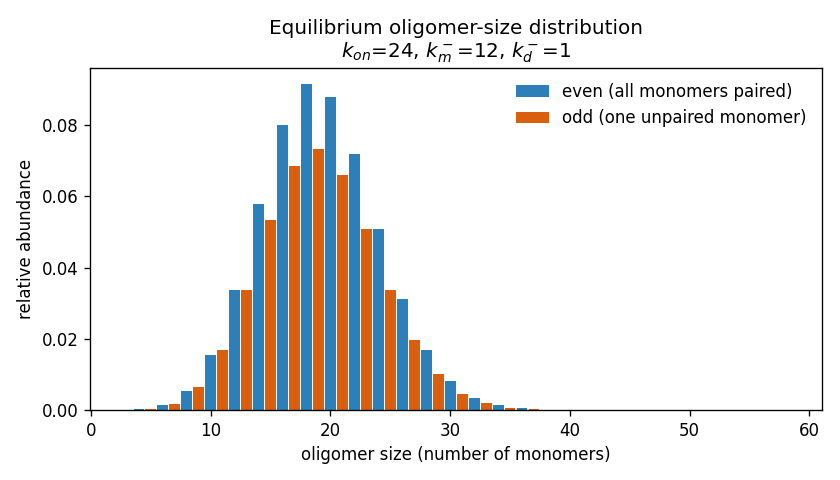
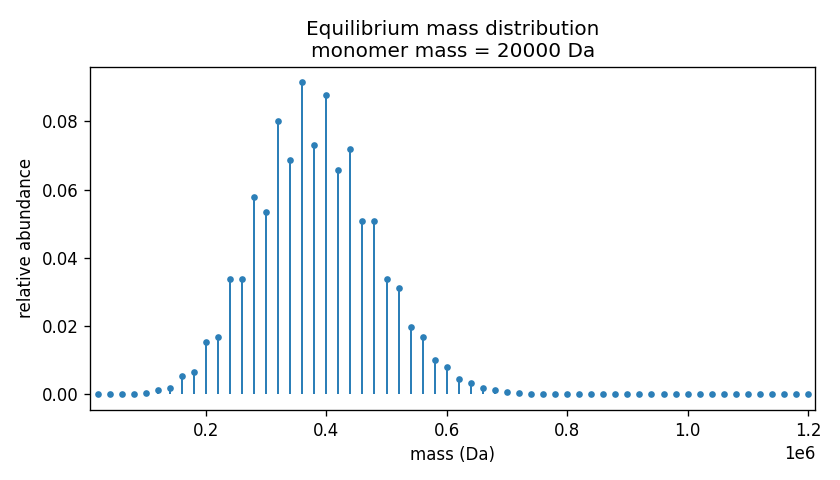

# polydisperse-assembly

Compute the equilibrium **oligomer-size** and **mass** distributions of a single
self-assembling, *polydisperse* protein from three rate constants.

Many proteins — small heat-shock proteins (sHsps) are a classic example — do not
form one well-defined complex but populate a whole range of oligomer sizes at
once. This package reproduces that size distribution using the exact equilibrium
solution of the "modified helical polymerisation" model (Baldwin *et al.*), in
which the protein grows and shrinks one monomer at a time with a built-in
preference for **even**-sized (fully paired) oligomers.

## The model

Assembly happens by sequential monomer addition,

```
P₁ + P₁ ⇌ P₂ ⇌ P₃ ⇌ … ⇌ Pᵢ
```

At equilibrium the abundance of each size follows a simple recursion. Because
monomers prefer to pair into dimers, an oligomer with an **even** number of
monomers (all paired) is more stable than one with an **odd** number (one
unpaired "spare" monomer), so the model uses two different off-rates:

```
even i :  [Pᵢ] / [Pᵢ₋₁] = k_on / ( i · k_off_dimer )
odd  i :  [Pᵢ] / [Pᵢ₋₁] = k_on / ( (i−1) · k_off_dimer + k_off_monomer )
```

Starting from the monomer and applying this recursion gives the full
distribution.

## The three rate constants

| parameter | symbol | what it controls |
|---|---|---|
| `k_on` | k⁺ | **Overall size.** How readily a monomer adds on. The distribution peaks near `k_on / k_off_dimer`; bigger `k_on` → bigger oligomers. |
| `k_off_dimer` | k⁻_d | How readily a monomer leaves a fully-paired (even) part of an oligomer. Breaking a dimer is hard, so this is usually the **smallest** rate. Bigger → smaller oligomers. |
| `k_off_monomer` | k⁻_m | **Even:odd bias.** How readily the single unpaired monomer leaves an odd-sized oligomer. When much larger than `k_off_dimer`, the spare monomer falls off fast and **even sizes dominate**. |

Only the *ratios* of the three rates matter, so `(24, 12, 1)` and `(48, 24, 2)`
give the same distribution. `k_on` is an effective ("pseudo-first-order") rate
that already includes the free-monomer concentration.

## Usage

```python
from oligomer_distribution import oligomer_distribution
from mass_distribution import mass_distribution

# Oligomer-size distribution: returns (sizes, abundance) as NumPy arrays
sizes, abundance = oligomer_distribution(
    k_on=24.0, k_off_monomer=12.0, k_off_dimer=1.0, max_size=60,
)

# ... write it to CSV (columns: oligomer_size,abundance) and/or pop up a plot
oligomer_distribution(24.0, 12.0, 1.0, csv_path="distribution.csv", plot=True)

# Mass distribution: same rates + a monomer mass -> (masses, abundance)
masses, abundance = mass_distribution(
    k_on=24.0, k_off_monomer=12.0, k_off_dimer=1.0,
    monomer_mass=20_000.0,        # Da (any mass unit works)
    csv_path="spectrum.csv", plot=True,
)
```

Every function returns plain NumPy arrays; the `csv_path` and `plot` arguments
are optional conveniences.

## Example output

`oligomer_distribution(24, 12, 1)` — a polydisperse, even-biased distribution
peaking near an 18-mer:



The same system as a mass spectrum, with a 20 kDa monomer
(`mass_distribution(24, 12, 1, 20_000)`):



## Requirements

- Python ≥ 3.8
- NumPy
- Matplotlib (only needed for plotting)

```
pip install -r requirements.txt
```

## Files

| file | purpose |
|---|---|
| `oligomer_distribution.py` | equilibrium oligomer-size distribution |
| `mass_distribution.py` | converts the size distribution to a mass spectrum |
| `example.py` | runnable example that produces the two figures above |
