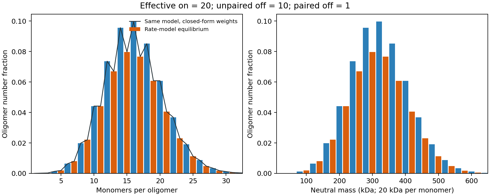

# Single-protein equilibrium distributions

`oligomer_distribution.py` evaluates the equilibrium recurrence of the modified
helical polymerisation model. Its larger oligomers have more possible monomer
exit sites. Paired sites dissociate at `k_off_dimer`; the single unpaired site
of an odd oligomer dissociates at `k_off_monomer`.

```text
even n:  [P_n]/[P_(n-1)] = k_on / (n*k_off_dimer)
odd n:   [P_n]/[P_(n-1)] = k_on / ((n-1)*k_off_dimer + k_off_monomer)
```

Here `k_on = k_plus * [P_1]` is an effective first-order rate containing the
free-monomer concentration. Only rate ratios determine the normalized curve.
All three rates affect the mode; `k_on/k_off_dimer` alone does not determine it.
The recurrence matches the thesis source and the equilibrium equations in
[Baldwin et al. (2011)](https://baldwinlab.chem.ox.ac.uk/publications/2011%20alphaB%201.pdf).

## Usage

From the repository root, after installing `requirements.txt`:

```python
from single.oligomer_distribution import oligomer_distribution
from single.mass_distribution import mass_distribution

sizes, number_fraction = oligomer_distribution(20, 10, 1, max_size=60)
masses, same_number_fraction = mass_distribution(20, 10, 1, monomer_mass=20_000)
```

Both functions return NumPy arrays and optionally accept `csv_path` and `plot`.
Normalized calculations use log weights to avoid overflow. With
`normalise=False`, weights are relative to the monomer and raise `OverflowError`
if those raw weights exceed floating-point range. Rates and monomer mass must
be finite and positive; `max_size` must be a positive integer.

## Reference result

At effective on = 20, unpaired off = 10, paired off = 1, with `max_size=60`:

| Quantity | Value |
| --- | ---: |
| Mode | 16 monomers |
| Mean | 16.012607 monomers |
| Number fraction above 24 monomers | 0.032656 |



Regenerate with `python -m single.example`. The line is the independently
evaluated closed-form equilibrium weight of the **same** rate model, described
in [statistical mechanics](statistical_mechanics/readme.md).

## Interpretation

- Fractions count oligomer molecules. Subunit fractions require weighting by
  size and renormalizing. Native MS intensities additionally require a response model.
- `mass_distribution` relabels size as neutral mass; it does not simulate a
  charge-state spectrum or change number fractions into mass fractions.
- `max_size` is a numerical truncation. Setting it to 24 conditions the curve
  on sizes at most 24; it does not establish a physical upper size limit.
- Total protein concentration is not an input. Predicting a concentration
  series from bimolecular `k_plus` requires solving free-monomer mass balance.
