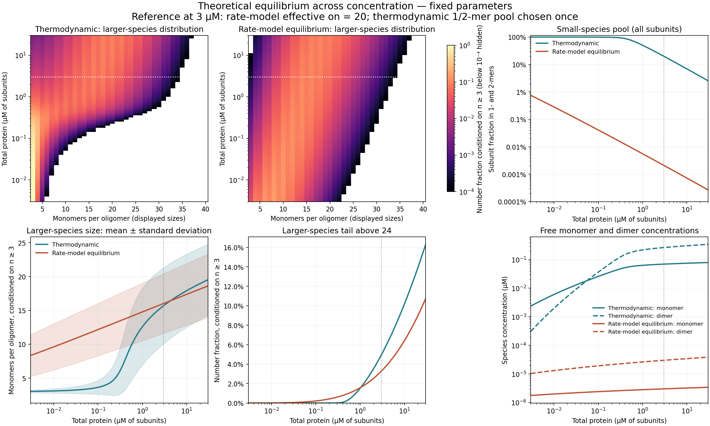

# Single-protein equilibrium distributions

Separate model folders:

- [Statistical mechanics](statistical_mechanics/readme.md): size weights and explicit geometry/contact states.
- [Thermodynamics](thermodynamics/readme.md): reservoir populations and formation-free-energy mass balance.

`oligomer_distribution.py` evaluates the equilibrium recurrence of the modified
helical polymerisation model. Its larger oligomers have more possible monomer
exit sites. Paired sites dissociate at `k_off_dimer`; the single unpaired site
of an odd oligomer dissociates at `k_off_monomer`.

```text
even n:  [P_n]/[P_(n-1)] = k_on / (n*k_off_dimer)
odd n:   [P_n]/[P_(n-1)] = k_on / ((n-1)*k_off_dimer + k_off_monomer)
```

Here `k_on = k_plus * [P_1]` is an effective first-order rate containing the
free-monomer concentration. Only rate ratios determine the normalized curve.
All three rates affect the mode; `k_on/k_off_dimer` alone does not determine it.
The recurrence matches the thesis source and the equilibrium equations in
[Baldwin et al. (2011)](https://baldwinlab.chem.ox.ac.uk/publications/2011%20alphaB%201.pdf).

## Usage

From the repository root, after installing `requirements.txt`:

```python
from single.oligomer_distribution import oligomer_distribution
from single.mass_distribution import mass_distribution

sizes, number_fraction = oligomer_distribution(20, 10, 1, max_size=60)
masses, same_number_fraction = mass_distribution(20, 10, 1, monomer_mass=20_000)
```

Both functions return NumPy arrays and optionally accept `csv_path` and `plot`.
Normalized calculations use log weights to avoid overflow. With
`normalise=False`, weights are relative to the monomer and raise `OverflowError`
if those raw weights exceed floating-point range. Rates and monomer mass must
be finite and positive; `max_size` must be a positive integer.

## Reference result

At effective on = 20, unpaired off = 10, paired off = 1, with `max_size=60`:

| Quantity | Value |
| --- | ---: |
| Mode | 16 monomers |
| Mean | 16.012607 monomers |
| Number fraction above 24 monomers | 0.032656 |


Regenerate with `python -m single.example`. The line is the independently
evaluated closed-form equilibrium weight of the **same** rate model, described
in [statistical mechanics](statistical_mechanics/readme.md).

## Interpretation

- Fractions count oligomer molecules. Subunit fractions require weighting by
  size and renormalizing. Native MS intensities additionally require a response model.
- `mass_distribution` relabels size as neutral mass; it does not simulate a
  charge-state spectrum or change number fractions into mass fractions.
- `max_size` is a numerical truncation. Setting it to 24 conditions the curve
  on sizes at most 24; it does not establish a physical upper size limit.
- `oligomer_distribution` takes an effective on-rate rather than total protein
  concentration. The mass-balance extension below predicts a concentration series.

## Theoretical concentration series

```bash
python -m single.compare_concentrations
```



This compares the thermodynamic model with the equilibrium of the rate model
over 0.003–30 µM of subunit equivalents. It uses no experimental data, fitting,
or time integration. Statistical mechanics and thermodynamics stay in their
separate folders; the comparison script reads independently solved results.

### Mass balance in the rate reference

`kinetic_equilibrium.py` extends the original recurrence to absolute concentrations:

```text
c_n = c_1 * w_n(k_plus*c_1)
C_total = sum_n n*c_n
```

The solver finds `c_1` in log concentration and expands the numerical size
support until its declining boundary has negligible subunit fraction.
`k_plus` is bimolecular, in concentration^-1 time^-1; off-rates are in time^-1.
The effective on-rate changes with free monomer rather than staying at 20
throughout the series. There is no physical 24-mer cap.

```python
from single.kinetic_equilibrium import anchor_kinetic_model, kinetic_equilibrium

model = anchor_kinetic_model(total_concentration=3, effective_on=20,
                             k_off_monomer=10, k_off_dimer=1)
r = kinetic_equilibrium(model, total_concentration=0.3)
# r.concentration, r.number_fraction, r.subunit_fraction include sizes 1 and 2.
larger_number_fraction = r.conditional_number_fraction(minimum_size=3)
```

### Parameters are chosen once

At the 3 µM reference, `c_1 = C_total/sum(n*w_n)` fixes one association constant
to recover the existing (20,10,1) curve. This gives `k_plus = 6.65523e6` in
µM^-1 per unspecified time unit and `c_1 = 3.00516e-6 µM`. These are a chosen
theoretical concentration scale, not measured rates or an estimate of physical
diffusion. Scaling all rates equally changes the time scale without changing
equilibrium predictions.

Separately, the thermodynamic model chooses a 20% monomer/dimer **subunit** pool
at that same reference using `enrich_reservoir` once. Its fixed coefficients
are b=6.70912749, s=8, h=0.18, d=4, u=0.3, a=1.49405813, with c0=1 µM.
No pool target or parameter is readjusted at other concentrations; neither
model's parameters are obtained by fitting the other model.

### Results

All means and tails below are **oligomer number fractions conditioned on n≥3**.
The pool column instead counts **all subunits** in monomers and dimers.
At low concentration the thermodynamic larger-species curve describes a tiny
population, since nearly all subunits are in the small pool.

| Total (µM) | Model | 1/2-mer pool | Mean size, n≥3 | Number fraction >24, n≥3 |
| ---: | --- | ---: | ---: | ---: |
| 0.003 | Thermodynamic | 99.9891% | 3.040 | <0.000001% |
| 0.003 | Rate equilibrium | 0.7484% | 8.347 | 0.0016% |
| 0.3 | Thermodynamic | 94.5350% | 5.848 | 0.0071% |
| 0.3 | Rate equilibrium | 0.0159% | 13.410 | 0.6006% |
| 3 | Thermodynamic | 20.0000% | 15.684 | 4.9306% |
| 3 | Rate equilibrium | 0.0021% | 16.015 | 3.2662% |
| 30 | Thermodynamic | 2.5536% | 19.516 | 16.2774% |
| 30 | Rate equilibrium | 0.0003% | 18.606 | 10.7160% |

Both larger-species curves peak at 16 at the reference, but their reservoirs
and concentration responses differ substantially. In the rate model the
relative concentrations of every size, including the dimer, follow the same
recurrence. Its dimer association constant is `k_plus/(2*k_off_dimer)`.
The thermodynamic model specifies dimer formation and the larger-family
formation offset separately. The similar peak therefore does not imply the
same equilibrium mechanism or agreement across a concentration series.

Six added tests check the independent equal-off-rate analytic solution
`c_1 = (k_off/k_plus)*W(k_plus*C_total/k_off)`, detailed balance, reference recovery,
unit/time conversions, support and numerical convergence, and fixed parameters
across the series. The plotted series conserves mass to relative error <4e-13.
All species concentrations remain accessible through `predict_series`;
displaying sizes 3–40 in the heatmaps does not truncate the calculation.

The next theoretical question is whether a physically motivated formation cost
for the larger family can produce the desired reservoir and size distribution
with fewer adjustable assumptions. Sensitivity of the concentration response
to dimer energy, surface cost, and packing cost can be explored before any data
are introduced.
