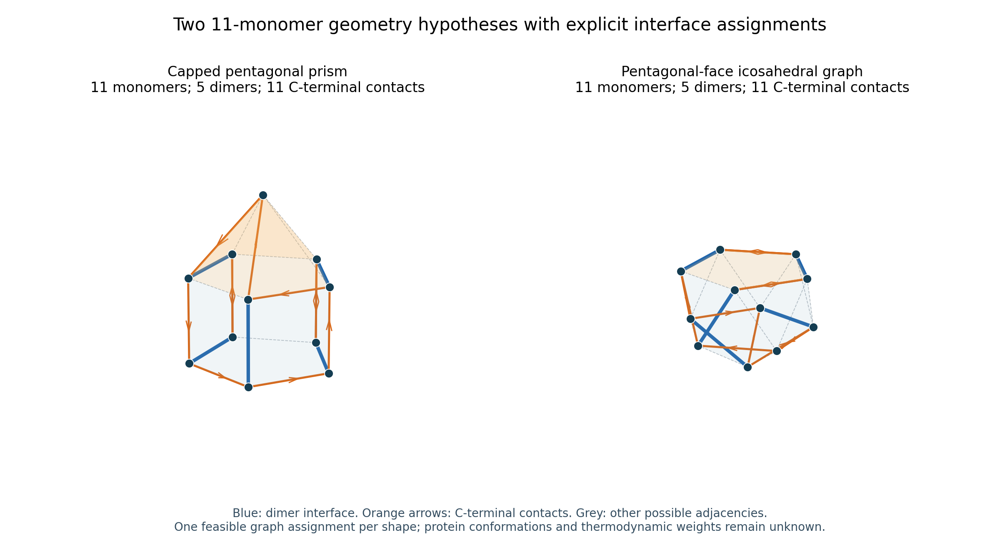

# Single-protein statistical mechanics

This folder contains an exact reformulation of the existing rate model and an
explicit framework for testing geometry-dependent equilibrium hypotheses.

## Exact equilibrium weights

Write `alpha = k_on_eff/k_d` and `r = k_m/k_d`. Relative to a monomer,

```text
w_1 = 1
w_n/w_(n-1) = alpha/n             (n even)
w_n/w_(n-1) = alpha/(n-1+r)       (n odd)
P(n) = w_n / sum_m w_m
```

`size_distribution.py` evaluates these products using log-gamma identities
(with a stable rising-factorial evaluation for large `r`). At equal off-rates,
the positive-size distribution is proportional to `alpha^(n-1)/n!`.

```python
from single.statistical_mechanics import energies_from_rates, site_count_distribution

energy = energies_from_rates(20, 10, 1)
p = site_count_distribution(energy.edge_kj_mol, energy.dimer_kj_mol, max_size=60)
```

The rate-derived parameters are `G_edge = -RT log(k_on_eff/k_m)` and
`G_dimer = -RT log(k_m/k_d)`. They include monomer activity and the chosen
addition reference states. `G_edge` is not automatically the free energy of
one C-terminal interface. This is a numerical check of the same detailed-balance
model, not an independently established geometric explanation of its curve.

## Geometry and actual interfaces

Two different graph conventions are kept explicit:

| File | Graph convention |
| --- | --- |
| `geometry.py` | One dimer per scaffold edge; C-terminal contacts connect monomers at scaffold vertices |
| `geometry_catalogue.py` | One monomer per vertex; graph edges are possible spatial adjacencies |

An octahedron is a 24-mer under the first convention and a six-mer under the
second. The monomer catalogue includes open paths, rings, tetrahedra from four
monomers, five-monomer pyramidal graphs, and selected larger compact graphs.
There is no mathematical rule excluding polyhedra below six. The catalogue is
finite and illustrative; it does not establish protein structures or enumerate
all conformations.

`geometry_weights.py` requires actual connected `BondPattern` networks:

- At most one dimer partner per monomer.
- At most one C-terminal donor and one receiver per monomer.
- C-terminal contacts outside a monomer's own dimer interface, an explicit assumption.
- Reciprocal C-terminal links count as two donor contacts.

`fully_bound_pattern` searches for a **joint** maximal dimer pairing and saturated
C-terminal assignment, allowing several C-terminal cycles joined by dimers. It
returns one feasible network, not its physical degeneracy. Nearest-neighbour odd
rings cannot fully saturate under these rules with `floor(n/2)` dimers. Partially
bound odd rings remain possible. Both illustrated 11-vertex polyhedra admit
five dimers and eleven C-terminal contacts simultaneously.



Regenerate with `python -m single.statistical_mechanics.draw_eleven_geometries`.
Coordinates are schematic and do not establish steric compatibility or a CCS.

`open_chain_pattern(n)` uses alternating dimer interfaces and reciprocal
interdimer contacts: `D=floor(n/2)`, `C=n-2` for even sizes and `C=n-1` for odd
sizes (the monomer has no contacts). `remove_monomer` removes actual incident
bonds without rewiring. Losing a monomer from a saturated scaffold breaks two
C-terminal contacts. A relaxed defect must be supplied as another explicit state.

## Conditional equilibrium shares

Each state requires a supplied residual shape free energy and a statistical
factor, including conformer/symmetry information where appropriate:

```text
log(q_s) = epsilon_dimer*D_s + epsilon_C*C_s - F_shape,s/kBT + log(g_s)
P(architecture | n) = sum_(s in architecture) q_s / sum_(all states at n) q_s
```

Positive `epsilon` favours contacts; all terms here are dimensionless. Do not
count conformational entropy in both `F_shape` and `g`. These quantities share
a common reference; physical values are not provided by the graph catalogue.

```python
from single.statistical_mechanics.geometry import cube, octahedron
from single.statistical_mechanics import (
    GeometryState, scaffold_pattern, conditional_geometry_shares,
)

# Illustrative supplied free energies and factors; neither is measured here.
states = [
    GeometryState("cube", scaffold_pattern(cube()), 2.0, 0.0),
    GeometryState("octahedron", scaffold_pattern(octahedron()), 0.0, 0.0),
]
shares = conditional_geometry_shares(states, epsilon_dimer=1, epsilon_c_terminal=1)
```

Both 24-mer states have twelve dimer and twenty-four C-terminal contacts.
Uniform contact energies cancel; only the supplied shape/factor difference
selects their shares. The [structural study](https://baldwinlab.chem.ox.ac.uk/publications/2011%20alphaB%203.pdf)
motivates dimer-on-edge candidates and tests structural envelopes using ion
mobility. It does not supply solution-state shape free energies.

Predicting `P(n)` independently also requires comparable partition functions
across sizes, monomer activity, and mass balance. A constant per-dimer energy
on rings gives a geometric size series with no selected interior mode. The
missing shape and entropy information cannot be recovered by simply renaming
the kinetic off-site factor. See the [audit](../../docs/audit.md) for retired
exploratory fits and the next useful experimental constraints.
