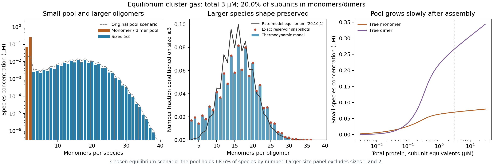

# Thermodynamic reservoir and oligomer model

Run from the repository root:

```bash
python -m single.thermodynamics.simulate_reservoir
```



## Paper and adaptation

The likely paper is Dear, Šarić, Michaels, Dobson and Knowles (2018),
[Statistical Mechanics of Globular Oligomer Formation by Protein Molecules](https://doi.org/10.1021/acs.jpcb.8b07805).
Its abstract describes amphiphilic monomers, a statistical-mechanical globular
model and comparison with coarse-grained Monte Carlo. The freely accessible
[supporting information](https://acs.figshare.com/articles/journal_contribution/Statistical_Mechanics_of_Globular_Oligomer_Formation_by_Protein_Molecules/7276157)
was read directly: Eqs. 2–4 give the ideal cluster ensemble; Eq. 6 contains a
bulk contribution, a surface term scaling as n^(2/3), and a connectivity penalty
scaling as n^(5/3). The main article's full text was unavailable here.

This is an adaptation of that thermodynamic structure. It does not reconstruct
the spatial amphiphile simulation, its interaction potential, or its fitted
coefficients. A monomer/dimer pool and an odd-size penalty are additional native
protein hypotheses. The n^(5/3) cost needs a physical justification or replacement
for folded sHSPs; it is not established by the geometry catalogue.

## Formation free energies

All energies refer to free monomers and a common standard concentration c0:

```text
F_1 = 0
F_2 = -d
F_n = -b*(n-1) + s*(n^(2/3)-1) + h*(n^(5/3)-1)
      + u*[n is odd] + a                                  for n >=3
```

`F_n = Delta G_n^0/kBT`; `b` is a bulk attraction coefficient, `s` a surface
coefficient, and `h>0` a packing/connectivity coefficient. The explicit dimer
stabilization `d` and unpaired penalty `u` extend the smooth cluster model.
`a` is a constant formation free-energy offset for the larger-oligomer family,
such as a hypothesized conformational cost per oligomer. It is an equilibrium
state cost, not an activation barrier. Its physical value remains unknown.
None is obtained from the kinetic rates. Surface and packing terms oppose
unbounded growth and can create a small-species population plus a finite-size
larger-species peak. Increasing total concentration still changes that peak.

These are effective **formation free energies**, which must include consistent
internal, symmetry and standard-state entropy contributions. They are not
energies assigned to every potential graph edge. No extra 1/n! size factor is
inserted. The ideal ensemble's factorial counts indistinguishable clusters of
the same size, through N_n!, rather than the subunits within a single cluster.

## Reservoir and mass balance

Let z = c_1/c0 be monomer activity and mu/kBT = log(z), relative to the chosen
standard monomer chemical potential. Ideal-mixture minimization gives

```text
c_n = c0 * exp(n*log(z) - F_n)
C_total = sum_n n*c_n
```

The script solves this mass balance for z. Every species has the same underlying
monomer chemical potential: dimers cannot be assigned an independent activity.
The low-size pool and larger clusters exchange material at equilibrium. It is
an internal pool in the closed calculation, not an extra compartment added to
its mass balance. `equilibrium_at_activity` also supports an externally clamped
open reservoir. Interactions between distinct clusters are omitted.

For x_n=c_n/c0, the dimensionless ideal-mixture free energy is
`sum_n x_n*(F_n + log(x_n)-1)`. Minimization at fixed `sum_n n*x_n` gives the
concentration formula above. The solver therefore uses equilibrium chemical
potentials, not on/off rates or a disguised dissociation-site recurrence.

Concentrations may use any consistent unit. Changing c0 without transforming
energies changes the physical model. Under c0' = r*c0, the conversion is
`F_n' = F_n - (n-1)*log(r)`.

## Use the API

```python
from single.thermodynamics.reservoir_thermodynamics import (
    GlobularModel, enrich_reservoir, globular_equilibrium, sample_reservoir,
)

model = GlobularModel(bulk_kbt=8, surface_kbt=8, packing_kbt=0.18,
                      dimer_binding_kbt=4, unpaired_penalty_kbt=0.3)
adjusted_model, r = enrich_reservoir(model, total_concentration=3,
                                    pool_subunit_fraction=0.2,
                                    standard_concentration=1)
# With concentrations interpreted in µM, total is 3 µM of subunit equivalents.
concentrations = r.concentration
number_fractions = r.number_fraction
subunit_fractions = r.subunit_fraction
higher_number_fractions = r.conditional_number_fraction(minimum_size=3)
counts = sample_reservoir(r, standard_state_particles=10000, snapshots=2000)
```

`closed_equilibrium` accepts a supplied array of formation free energies for
sizes 1..M, with F_1=0. This permits another physically motivated free-energy
family without changing the reservoir solver. Its caller must check size support.
`globular_equilibrium` extends the support until the declining high-size boundary
has negligible subunit fraction; it does not impose a physical 24-mer cap.

`sample_reservoir` draws exact independent Poisson cluster counts from the ideal
grand-canonical ensemble at the solved chemical potential. Its scale is
`N_A*V*c0`, with molar concentration and volume in consistent units. Mean total
protein matches the closed macroscopic calculation, but individual snapshots
fluctuate in protein count. They are not a finite fixed-N simulation, a spatial
particle trajectory, or physical exchange kinetics.

Change parameters or write another figure with CLI flags:

```bash
python -m single.thermodynamics.simulate_reservoir --pool-subunit-fraction 0.3 --output outputs/reservoir_enriched.png
python -m single.thermodynamics.simulate_reservoir --pool-subunit-fraction 0 --total 0.1 --output outputs/reservoir_low.png
```

## Enlarging the monomer/dimer pool

The default CLI chooses 20% of subunits in sizes 1 and 2 at the selected total
concentration, while preserving the original conditional distribution for sizes
at least three. The target must exceed the original pool fraction and be below
one. `--pool-subunit-fraction 0` runs the unadjusted model.

The helper solves the monomer/dimer mass balance for the selected pool mass,
then weakens bulk association and adds a formation offset for sizes >=3. Let
`delta` be the increase in log monomer activity and `A` the required common
scale of larger-species concentrations. Choosing

```text
b_new = b_old - delta
a_new = a_old + delta - log(A)
```

gives `c_n,new = A*c_n,old` for every n>=3. This leaves their **conditional**
number fractions unchanged at the selected total. Total protein is conserved;
the larger species become less abundant in absolute concentration. This is a
constructed scenario using two free-energy adjustments, not a uniquely inferred
mechanism. The dimer binding energy is unchanged, so `c_2` scales as `c_1^2`.

The resulting energies are fixed for the plotted concentration series. The
chosen 20% pool is not imposed again at each concentration, and the larger-size
distribution generally changes as concentration changes.

## Illustrative result and verification

At c0=1 µM and C_total=3 µM:

| Quantity | Original | Enlarged pool (default plot) |
| --- | ---: | ---: |
| Free monomer | 0.01917 µM | 0.06969 µM |
| Free dimer | 0.02006 µM | 0.26516 µM |
| Monomer/dimer subunit fraction | 1.98% | 20.00% |
| Monomer/dimer number fraction | 17.30% | 68.63% |
| Bulk coefficient b | 8.0000 kBT | 6.7091 kBT |
| Larger-family offset a | 0 kBT | 1.4941 kBT |

The full number distribution has its mode at the dimer.
**Conditioned on sizes at least three**, both scenarios have the same curve:
the mode is 16, the mean is 15.6842, and the fraction above 24 is 4.93%.
The figure conditions the kinetic comparison on the same support. Its total
variation distance from the (20,10,1) curve is 0.1337; the shapes differ despite
their shared mode. Matching the mode does not establish experimental agreement.
The coefficients were selected to illustrate a finite-size peak, not fitted.

Eight reservoir tests check the analytic monomer/dimer limit, mass conservation,
shared chemical potential, standard-state conversion, support convergence,
concentration-dependent pooling, reservoir count statistics, and preservation of
the larger-species shape when enriching the small pool. Run the full
suite with `python -m unittest discover -v`.

A useful next test is a concentration series with measured small-species and
oligomer abundances under an explicit MS response model. Geometry-specific
partition functions can replace the phenomenological F_n once their relative
free energies and conformer weights are available.
